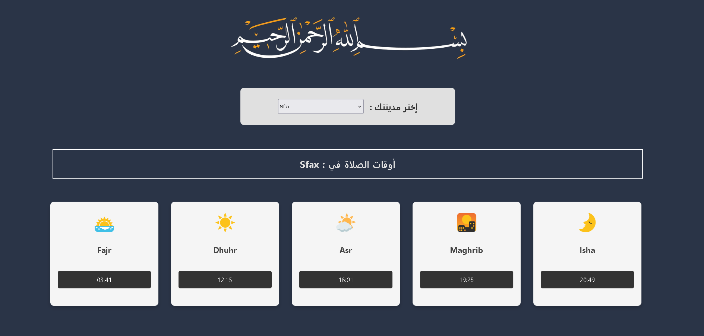
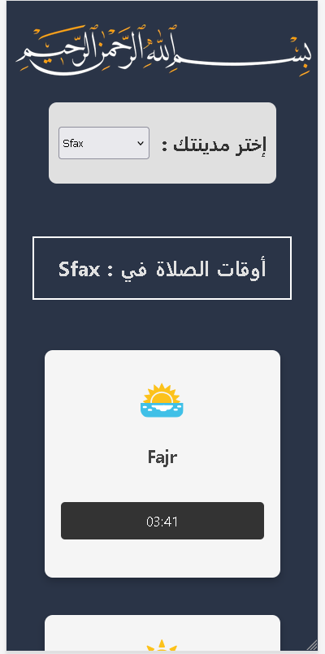

# Project deploy link
salat-time2024.netlify.app
## Description

I developed a Prayer Times Application utilizing React.js and Material-UI, focusing on responsive design to ensure seamless functionality on small screens. By integrating APIs, users could select their city, and the application dynamically fetched and displayed accurate prayer times accordingly. This approach enhanced user experience, providing convenience and reliability for those seeking prayer timings.

<div align="center">
    
    
</div>

## Installation

Step-by-step instructions on how to install and set up the project.

```bash
# Clone the repository
git clone https://github.com/youssefdhouib/cercina_company_landing-page.git

# Navigate to the project directory
cd cercina_company_landing-page

# Install dependencies
npm install
```
## Usage

To use the project, follow these steps:

1. Clone the repository
2. Install dependencies
3. Start the development server
4. Open the project in your browser

## Features

This project includes the following features:

- Responsive design: Works well on various screen sizes.
- Interactive elements: Engaging user experience.
- Modern UI: Sleek and visually appealing design.
- the usage of MATERIAL UI.

## Screenshots

Here are some screenshots of the project:

- Homepage
  
                   <div align="center"></div><br>
  *Caption: Homepage*


## Contact

For any questions or feedback, feel free to contact me at [dhouibyoussef222@gmail.com](mailto:dhouibyoussef222@gmail.com).<br>
Linkdin profile : www.linkedin.com/in/youssef-dhouib-yd2003 <br>
Project Link: https://github.com/youssefdhouib/salat_time_app


